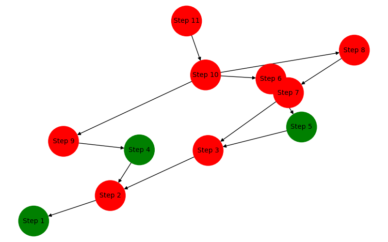

# Python Development Assessment

This Python web API checks the health of a system composed of multi-level correlated components in a **Directed Acyclic Graph (DAG)** format. It processes a JSON file representing the system structure, evaluates the health of each component asynchronously, and presents the results in a **table format** and as a **graph image** where failed components are highlighted in red.

##  Installation

1. **Clone the repository**:
   ```sh
   git clone https://github.com/yourusername/system-health-checker.git
   cd system-health-checker
   ```

2. **Create a virtual environment** (optional but recommended):
   ```sh
   python -m venv venv
   source venv/bin/activate  # On Windows, use: venv\Scripts\activate
   ```

3. **Install dependencies**:
   ```sh
   pip install -r requirements.txt
   ```

4. **Run the API**:
   ```sh
   uvicorn main:app --reload
   ```

---

## API Usage

### **1️ Upload JSON file**
Send a `POST` request to upload a JSON file.

**Endpoint:**
```
POST /upload
```

**Example cURL request:**
```sh
curl -X POST "http://127.0.0.1:8000/upload" \
     -H "accept: application/json" \
     -H "Content-Type: multipart/form-data" \
     -F "file=@dag.json"
```

**Example JSON File (`dag.json`):**
```json
{
    "Step 1": ["Step 2"],
    "Step 2": ["Step 3", "Step 4"],
    "Step 3": ["Step 5", "Step 7"],
    "Step 4": ["Step 9"],
    "Step 5": ["Step 6"],
    "Step 6": ["Step 10"],
    "Step 7": ["Step 8"],
    "Step 8": ["Step 10"],
    "Step 9": ["Step 10"],
    "Step 10": ["Step 11"],
    "Step 11": []
}
```

---

##  Example Output

### **1️ Health Check Table**
| Component | Health Status |
|-----------|--------------|
| Step 1    | Healthy      |
| Step 2    | Unhealthy    |
| Step 3    | Healthy      |
| Step 4    | Healthy      |
| Step 5    | Unhealthy    |
| Step 6    | Healthy      |
| Step 7    | Unhealthy    |
| Step 8    | Healthy      |
| Step 9    | Healthy      |
| Step 10   | Unhealthy    |
| Step 11   | Healthy      |

### **2️ Graph Visualization**
The system structure is displayed as a **graph**, with:
- **Healthy nodes** in **green**
- **Unhealthy nodes** in **red**

Graph Example:

